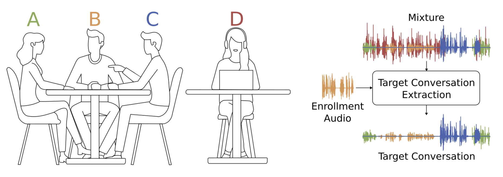

# Target-Conversation-Extraction
This is the code and dataset repo for Interspeech 2024 paper "Target conversation extraction: Source separation using turn-taking dynamics"

## Problem Definition

This task is used to extract the conversation in noisy environment given the embedding/enrollment of one speaker in the conversation. In other word, this paper tried to solve the new problem "who talk with me?".

## Dataset Prepare
Our dataset contains
We first pre-train the model with synthetic conversational dataset from non-conversational dataset like [LibriTTS](http://www.openslr.org/60)(English) and [Aishell-3](https://www.openslr.org/93/)(Mandrain). 

### generate conversational dataset
The real conversational datasets we used are [AMI Corpus](https://groups.inf.ed.ac.uk/ami/corpus/)(English) and [ASR_RAMC](https://magichub.com/datasets/magicdata-ramc/)(Mandrain)

### synthesize and augment dataset

## Model Prepare

